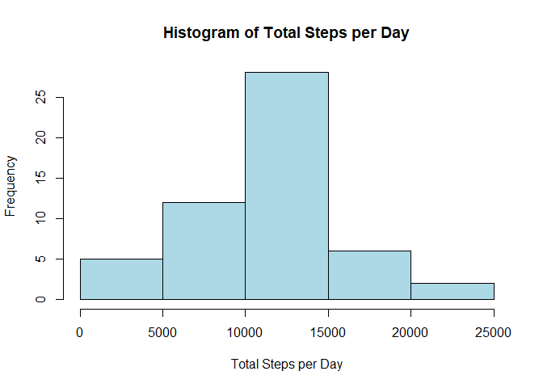
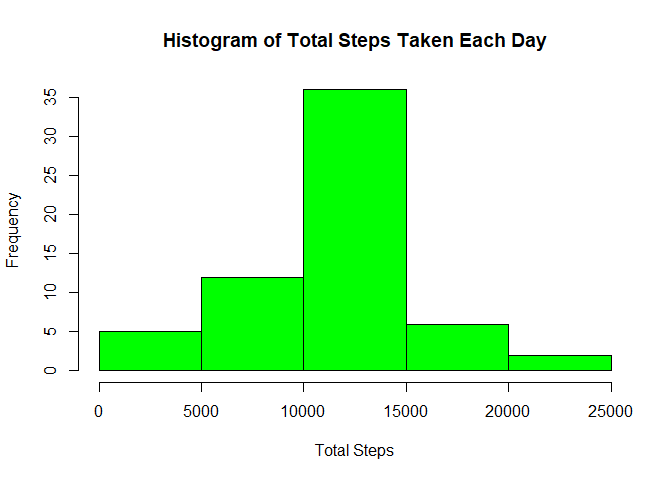

---


## Loading and preprocessing the data

```r
data <- read.csv("C:/Users/F&R/Desktop/DS/DS5/activity.csv")
```

## What is mean total number of steps taken per day?

### Calculate the total Steps  

```r
total_steps <- aggregate(steps ~ date, data = data, FUN = sum, na.rm = TRUE)
```
### Histogram Plot 

```r
hist(total_steps[,2], main = "Histogram of Total Steps per Day", xlab = "Total Steps per Day", ylab = "Frequency", col = "lightblue")
```

<!-- -->
### Calculate mean and the median
To calculate the mean and median of the total steps per day, you can use the mean() and median() functions, respectively, on the vector containing the total steps per day.

```r
mean_steps <- mean(total_steps[,2])
mean_steps
```

```
## [1] 10766.19
```

```r
median_steps <- median(total_steps[,2])
median_steps
```

```
## [1] 10765
```

## What is the average daily activity pattern?
To create a time series plot with the 5-minute interval on the x-axis and the average number of steps taken across all days on the y-axis, you can follow these steps:

1. Aggregate the data to calculate the average number of steps taken for each 5-minute interval.
2. Plot the resulting averages.

### Convert the 'date' column to POSIXct type for proper time series plotting

```r
data$date <- as.POSIXct(data$date)
```
### Aggregate data to calculate average steps per 5-minute interval

```r
avg_steps <- aggregate(steps ~ interval, data = data, FUN = mean, na.rm = TRUE)
```
### Create the time series plot

```r
plot(avg_steps$interval, avg_steps$steps, type = "l", xlab = "5-minute Interval", ylab = "Average Steps Taken", main = "Average Steps Taken per 5-minute Interval")
```

<!-- -->
### Find the index of the interval with the maximum average steps

```r
max_index <- which.max(avg_steps$steps)
```
### Retrieve the corresponding 5-minute interval

```r
max_interval <- avg_steps$interval[max_index]
```
### Print the result

```r
cat("The 5-minute interval with the maximum average steps is:", max_interval, "\n")
```

```
## The 5-minute interval with the maximum average steps is: 835
```


## Imputing missing values

A simple strategy for filling in missing values in the dataset could involve using the mean for that specific 5-minute interval. Here's a step-by-step approach:

1. Group the data by the 5-minute intervals.
2. Calculate the mean steps for each 5-minute interval.
3. For each missing value in the dataset, fill it with the mean steps corresponding to the 5-minute interval of that missing value.

### Calculate total number of missing values in the dataset

```r
total_missing <- sum(is.na(data$steps))
# Print the result
cat("Total number of missing values in the dataset:", total_missing, "\n")
```

```
## Total number of missing values in the dataset: 2304
```

### Create a copy of the original data frame

```r
filled_data <- data

# Group the data by 5-minute intervals and calculate the mean steps for each interval
interval_means <- aggregate(steps ~ interval, data = filled_data, FUN = mean, na.rm = TRUE)

# Fill in missing values with mean steps for each 5-minute interval
for (i in 1:nrow(filled_data)) {
  if (is.na(filled_data$steps[i])) {
    interval <- filled_data$interval[i]
    mean_steps <- interval_means$steps[interval_means$interval == interval]
    filled_data$steps[i] <- mean_steps
  }
}
```
### Now, 'filled_data' contains the original data with missing values filled in
To create a histogram of the total number of steps taken each day and calculate the mean and median total number of steps taken per day, you can follow these steps:
  
1. Aggregate the data to calculate the total number of steps taken each day.
2. Create a histogram of the total number of steps taken each day.
3. Calculate the mean and median of the total number of steps taken per day.

### Step 1: Aggregate the data to calculate the total number of steps taken each day

```r
total_steps_per_day <- aggregate(steps ~ date, data = filled_data, FUN = sum)
```
### Step 2: Create a histogram of the total number of steps taken each day

```r
hist(total_steps_per_day$steps, main = "Histogram of Total Steps Taken Each Day", xlab = "Total Steps", ylab = "Frequency", col = "green")
```

<!-- -->
### Step 3: Calculate the mean and median of the total number of steps taken per day

```r
mean_steps_per_day <- mean(total_steps_per_day$steps)
median_steps_per_day <- median(total_steps_per_day$steps)
```
### Print the mean and median

```r
cat("Mean total number of steps taken per day:", mean_steps_per_day, "\n")
```

```
## Mean total number of steps taken per day: 10766.19
```

```r
cat("Median total number of steps taken per day:", median_steps_per_day, "\n")
```

```
## Median total number of steps taken per day: 10766.19
```


## Are there differences in activity patterns between weekdays and weekends?
To analyze the differences in activity patterns between weekdays and weekends, you can follow these steps:

1. Create a new factor variable indicating whether each date is a weekday or a weekend day.
2. Calculate the average number of steps taken for each 5-minute interval separately for weekdays and weekends.
3. Create a panel plot containing two time series plots: one for weekdays and one for weekends, showing the average number of steps taken for each 5-minute interval.

### Convert the 'date' column to a Date type

```r
filled_data$date <- as.Date(filled_data$date)
```
### Step 1: Create a new factor variable indicating weekdays or weekends

```r
filled_data$day_type <- ifelse(weekdays(filled_data$date) %in% c("Saturday", "Sunday"), "weekend", "weekday")
```
### Step 2: Calculate the average number of steps for each 5-minute interval separately for weekdays and weekends

```r
avg_steps_by_day_type <- aggregate(steps ~ interval + day_type, data = filled_data, FUN = mean, na.rm = TRUE)
```
### Step 3: Create a panel plot

```r
library(ggplot2)

ggplot(avg_steps_by_day_type, aes(x = interval, y = steps, group = day_type, color = day_type)) +
  geom_line() +
  facet_wrap(~ day_type, ncol = 1) +
  labs(title = "Average Number of Steps Taken by 5-minute Interval", x = "5-minute Interval", y = "Average Number of Steps") +
  theme_minimal()
```

<!-- -->

### Results Explained 
Observing the graph above, we can see that, out of all the periods, weekday activity has the largest peak (> 300) and the fewest peaks that reach 100. Conversely, compared to weekday intervals, weekend intervals feature more peaks over a hundred. It's possible that the person from whom the data is gathered leads a more active lifestyle on weekends than they do during the workweek.
